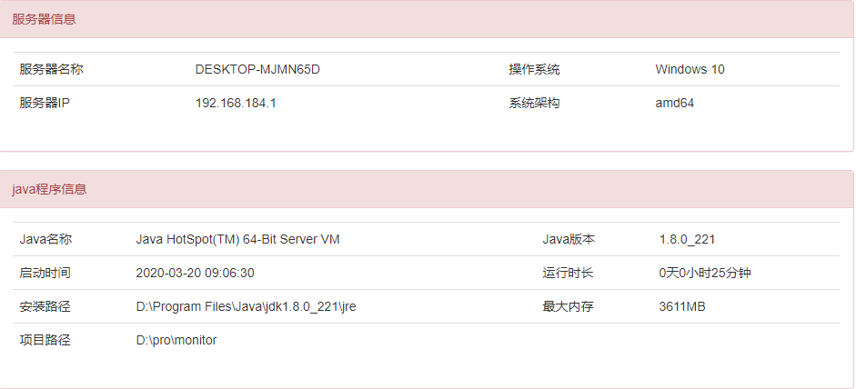

## 服务器监控demo  
1. 项目地址:  
 -- github：https://github.com/gaofujie2626/monitor.git  
 -- gitee：https://gitee.com/smlhd/monitor.git  
#### 使用步骤：
-------
1.克隆代码  
`git clone https://gitee.com/smlhd/monitor.git`  
2.进入项目根目录，编译打包  
`mvn package -Dmaven.test.skip=true`  
3.运行  
`java -jar target/monitor.jar`  
4.打开浏览器  
`http://localhost:8080/`  

效果图：
------
#### 1.CPU监控信息  
 
------
#### 2.内存监控信息  
  
------
#### 3.jvm监控信息

------
#### 4.程序和服务器信息

------
#### 5.磁盘监控信息

------
